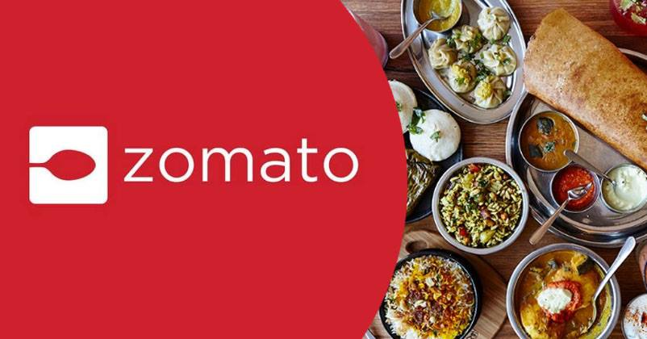

# Zomato-Restaurant-Data-Analysis
Downloaded restaurant data from zomato website for more than 56251 restaurants across Bengaluru, India. Ingested this data in MySQL database and performed ETL to remove outliers, clean up bad records, normalize revenue numbers to standard format using python, jupyter notebook and two standard deviation along with some other statistical techniques. For analysis of Bengaluru restaurants, used Excel, VBA macros and pivot table. Figured out best restaurants for north indian and south indian cuisine based on reviews.

